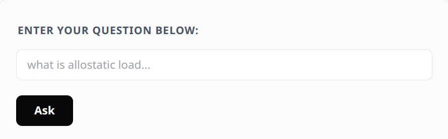
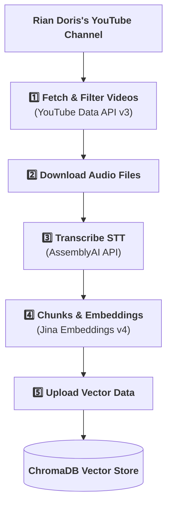
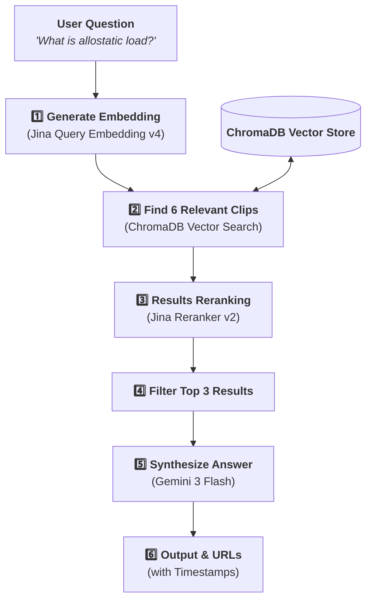

<h1 align="center">🔎 YouTube RAG Engine</h1>

<p align="center">
  Quickly find information from Rian Doris' YouTube channel.
</p>

<p align="center">
  <a href="#why-i-built-this">Why I Built This</a> • 
  <a href="#the-tech-stack-i-used">Tech Stack</a> • 
  <a href="#part-1-the-ingestion-pipeline">Ingestion</a> • 
  <a href="#part-2-the-retrieval-process">Retrieval</a> • 
  <a href="#features">Features</a> • 
  <a href="#running-it-locally">Running It Locally</a>
</p>

---

## 💡 Why I Built This

I'm a big fan of Rian Doris's YouTube channel.

The problem is trying to recall a specific thing he said. Whenever I tried to search for that exact thing, I could never find the right video.

I built this project to fix that.

It is a semantic search engine for his entire YouTube channel. 

You ask a question in plain English, and it finds the exact moments in his videos and gives you a straight answer.

You can check out this RAG engine in action using the link below:

<p>
  <strong>➡️ <a href="https://varunsharma.co/projects/youtube-rag">Check out the Live Demo Here!</a></strong>
</p>

<p align="center">
  <a href="https://varunsharma.co/projects/youtube-rag">
    
  </a>
</p>


## 🛠️ The Tech Stack I Used

| Category           | Technologies & Services                                                                                                               |
| :----------------- | :------------------------------------------------------------------------------------------------------------------------------------ |
| **Backend**        | Python, FastAPI                                                                                                              |
| **Data & AI**      | **Vector DB:** ChromaDB Cloud <br> **Embeddings & Reranking:** Jina AI <br> **Transcription:** AssemblyAI <br> **LLM:** Google Gemini |
| **Cloud** | Docker, Google Cloud Run, Google Artifact Registry    

## ⚙️ How It All Works

### 📥 Part 1: The Ingestion Pipeline



### 🔍 Part 2: The Retrieval Process



## ✨ Features

*   **Automated Data Ingestion:** The pipeline automatically pulls new videos from the YouTube channel and extracts the transcripts. 

*   **Context-Aware Chunking:** The custom chunking algorithm is context-aware, it keeps whole sentences intact. This improves the search accuracy & the final answer.

*   **Two-Step Retrieval & Reranking:** By using a reranker, the irrelevant vectorDB search results are filtered out. And only the most relevant context is passed to the LLM for synthesizing the answer.

*   **Exact Timestamp Citations:** You get precise YouTube timestamps that jump to the exact second Rian discusses the topic in the video.

*   **Cloud Deployment:** Containerized & deployed as a FastAPI application on Google Cloud Run. So it's scalable & cost-efficient.                                                                                |

## 💻 Running It Locally

To run it yourself, first you run the Ingestion pipeline. Then you can do the Retrieval part.

First, You'll Need:

- Python 3.8 or newer.
- Docker installed on your machine.
- A Google Cloud Platform (GCP) account and the Google Cloud CLI (`gcloud`) set up if you want to deploy it to the cloud.
- A bunch of API keys for the services it uses.

### 1. Set Up Your API Keys

Create a file named `.env` in the main folder and paste this in. You'll need to fill it out with your own keys.

**`.env` Template:**

```env
# --- KEYS FOR BOTH SYSTEMS ---
# Jina AI (Embeddings & Reranker)
JINA_API_KEY="YOUR_JINA_API_KEY"
JINA_EMBEDDING_MODEL_VERSION="v4" 
RELEVANCE_SCORE_THRESHOLD="0.6"

# Google Gemini (LLM for Summaries & Answers)
GEMINI_API_KEY="YOUR_GEMINI_API_KEY"

# ChromaDB Cloud
CHROMA_API_KEY="YOUR_CHROMA_API_KEY"
CHROMA_TENANT="YOUR_CHROMA_TENANT_NAME"
CHROMA_DATABASE="YOUR_CHROMA_DATABASE_NAME"

# --- KEYS FOR INGESTION ONLY ---
# Google / YouTube
YOUTUBE_API_KEY="YOUR_YOUTUBE_DATA_API_KEY"

# AssemblyAI (Transcription)
ASSEMBLYAI_API_KEY="YOUR_ASSEMBLYAI_API_KEY"
```

### 2. Run the Ingestion Pipeline

This script will go through the YouTube channel and load all the knowledge into your ChromaDB collection.

```bash
# 1. Set up a virtual environment (good practice!)
python3 -m venv venv
source venv/bin/activate

# 2. Install all the Python packages
pip install -r requirements.txt

# 3. Open up main_ingestion.py and double-check the
#    CHANNEL_URL and CHROMA_COLLECTION_NAME variables.

# 4. Let it run!
python main_ingestion.py
```

This might take a while. You can see the progress in the terminal.

### 3. Ask it Questions (Run the API Locally)

Once ingestion is complete, start the API server.

```bash
# 1. Make sure your virtual environment is still active
source venv/bin/activate

# 2. Start the local server
uvicorn api_main:app --reload
```

Now you can send requests to `http://127.0.0.1:8000`. Here’s a quick `curl` command to test it:

```bash
curl -X POST "http://127.0.0.1:8000/rag/query" \
-H "Content-Type: application/json" \
-d '{"query": "what is allostatic load"}'
```
